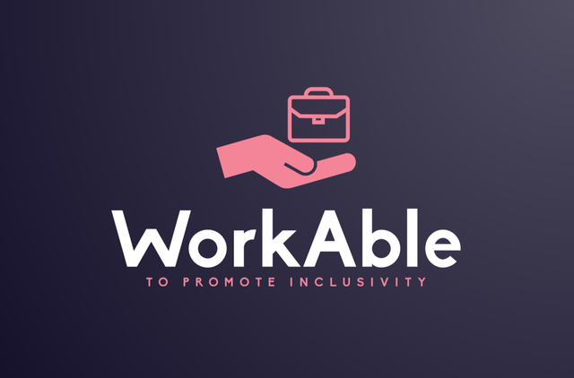
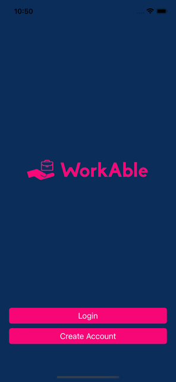
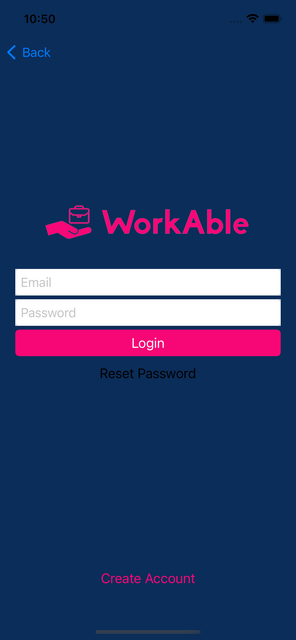
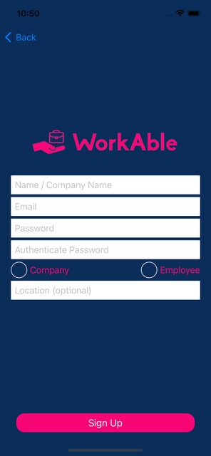
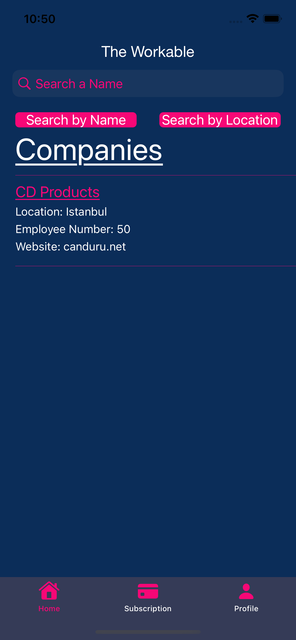
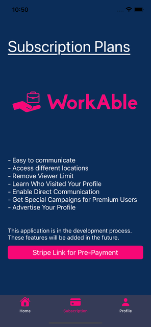
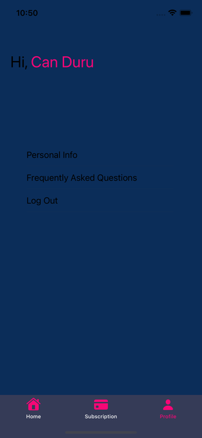

[![Swift Version][swift-image]][swift-url]
[![Platform][platform-image]][platform-url]
[![License][license-image]][license-url]

# Workable

<br />
<p align="center">
  <a href="https://canduru.net">
    
  </a>
  <br />
  
  <p align="center">
    This app is created with Swift to iOS platform using Firebase. Users can sign up as a company or employee, see available opportunities, and apply for them.
  </p>
</p>

Workable is a UIKit iOS app built for the FutureGorge startup during the LaunchX
Entrepreneurship Summer Program (2023). It is a two-sided directory: a person signs up
as an **Employee** or as a **Company**, fills in a short profile, and browses the other
side of the market from a searchable, auto-refreshing list. It is aimed at early-stage
companies hiring for ESG-related roles and at candidates looking for them.

## Status

This application is currently in the development stage. It was last worked on during the
LaunchX 2023 program and is published here as a portfolio project; it is not on the App Store.

> **Note on naming:** the repository is called *Workable*, but the Xcode project, target and
> bundle identifier still carry the product's earlier name, *ESG Connect*
> (`ESG Connect.xcodeproj`, source in `ESGConnect/`, bundle id `com.CanDuru.ESG-Connect`).

## Features

- [x] Sign Up with Different User Profiles
- [x] See Available Options for Hiring or Applying
- [x] Search for Suitable Options
- [x] Email/password sign up and log in, with the session restored on launch
- [x] Filter the list by companies or employees, and search it by name or by location
- [x] Automatic list refresh every 60 seconds
- [x] Profile tab with a personalized greeting, editable personal details, email and password change, and log out
- [x] In-app FAQ, privacy policy and Stripe pre-payment pages, opened in a web view from links stored in Firebase
- [x] Push notification registration through Firebase Cloud Messaging
- [x] Firebase App Check with App Attest

## Tech Stack

- **Swift 5.0**, UIKit, programmatic Auto Layout (no main storyboard; only `LaunchScreen.storyboard`)
- **Firebase** — Auth, Cloud Firestore (`users` collection), Realtime Database (web links), Cloud Messaging, App Check (App Attest), Analytics, Crashlytics, Performance, In-App Messaging
- **WebKit** (`WKWebView`) for the FAQ, privacy policy and payment pages
- **Swift Package Manager** for dependency management (Firebase 12.19.1)

## Requirements

- iOS 15.0+ (test targets require iOS 17 or later)
- Xcode 27
- A Firebase project with Auth, Cloud Firestore and Realtime Database enabled

## Installation

1. Clone the repository and open the project directory.

2. **Dependencies.** Open `ESG Connect.xcodeproj` in Xcode 27 or later. Swift Package Manager
   resolves the pinned Firebase packages automatically; CocoaPods is no longer required.

3. **Firebase configuration.** Download `GoogleService-Info.plist` from your Firebase
   project and drop it into `ESGConnect/`. The Xcode project already expects that file as a
   bundle resource, and `.gitignore` keeps it out of version control; never commit it. Without
   it the app shows a setup screen instead of calling Firebase.

4. Build and run the shared `ESG Connect` scheme on an iOS 15.0+ simulator or device. App Attest
   needs a real device; on the simulator, register a debug App Check token in the Firebase console.

### Configuration the app reads at runtime

The app has no `.env` file. Everything outside the source lives in Firebase:

| Where | Key / path | Used for |
| --- | --- | --- |
| `ESGConnect/GoogleService-Info.plist` | whole file | Firebase project credentials |
| Realtime Database (child object) | `faq` | URL opened by the FAQ screen |
| Realtime Database (child object) | `privacy_policy` | URL opened from the sign-up screen |
| Realtime Database (child object) | `payment` | Stripe pre-payment URL opened by the Subscription tab |
| Cloud Firestore | `users/{uid}` | Profile documents backing the home list and profile tab |

The Realtime Database URL is currently hard-coded in the view controllers that read it, so
point those at your own instance if you fork the project.

### Crashlytics symbol upload

For signed Release archives using a custom package checkout directory, set the
`FIREBASE_SOURCE_PACKAGES_DIR` build setting to the same absolute directory passed to
`-clonedSourcePackagesDirPath`. Without an override, the Crashlytics phase uses Xcode's standard
DerivedData package directory. Missing scripts fail with a setup instruction. Unsigned builds and
simulator builds do not upload symbols.

## Project Structure

```
ESG Connect.xcodeproj/        Xcode project
ESG Connect.entitlements      Push notification entitlement
ESGConnect/
├── AppDelegate.swift         Firebase, App Check and push notification setup
├── SceneDelegate.swift       Root view controller selection
├── TabBarViewController.swift  Home / Subscription / Profile tabs
├── Credentials/              Welcome, log in and sign up screens
├── Home/                     Searchable, auto-refreshing opportunity list and its cell
├── Profile/                  Profile, personal info, FAQ and settings cell
├── Subscription/             Stripe pre-payment web view
├── Helper/AppCheck.swift     App Attest provider factory
├── Assets.xcassets/          Colors, app icon and logos
└── Info.plist
docs/assets/                  README images
CHANGELOG.md
```

## Photos from the Application

<p align="center">


</p>

<p align="center">


</p>

<p align="center">


</p>

## License

Distributed under the MIT License. See [`LICENSE`](LICENSE) for details.

## Meta

Can Duru – [canduru.net](https://canduru.net) – canduru2004@gmail.com, support@canduru.net

[https://github.com/CanDuru4](https://github.com/CanDuru4)

[swift-image]: https://img.shields.io/badge/swift-5.0-orange.svg
[swift-url]: https://swift.org/
[platform-image]: https://img.shields.io/badge/platform-iOS%2015.0%2B-lightgrey.svg
[platform-url]: https://developer.apple.com/ios/
[license-image]: https://img.shields.io/badge/license-MIT-blue.svg
[license-url]: LICENSE
